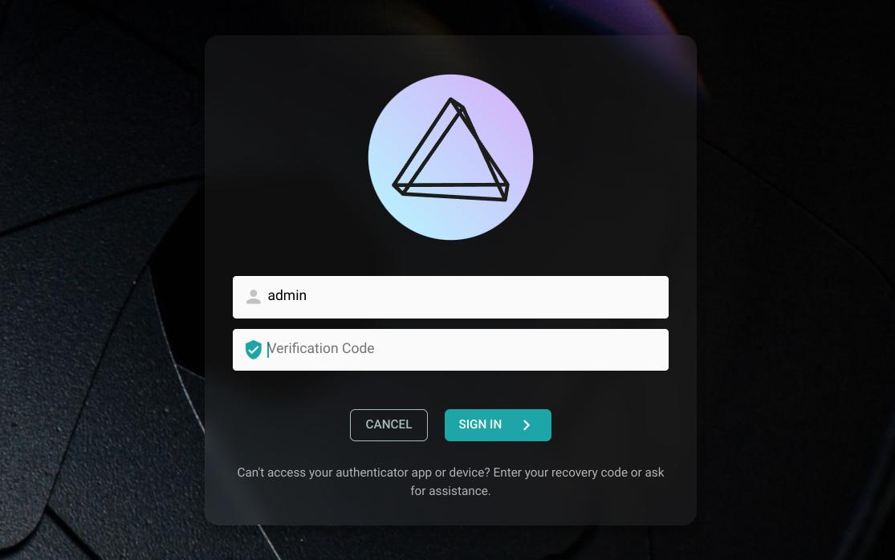
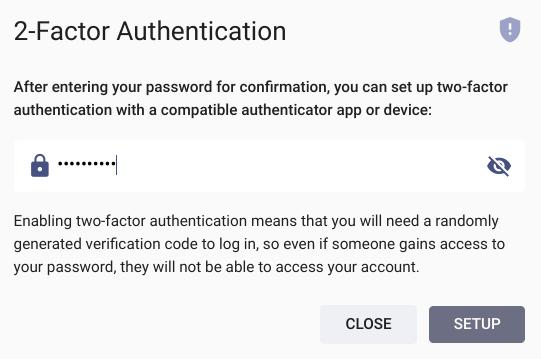

# 2-Factor Authentication

Two-factor authentication (2FA) can add an extra layer of security to [your account](../settings/account.md) in case someone gains access to your password. If enabled, you will need a randomly generated verification code in addition to your password to log in:

{ class="shadow" }

### Authenticator Apps

To enable 2FA for your account, you need a compatible authenticator app or device, for example:

- [Google Authenticator](https://apps.apple.com/us/app/google-authenticator/id388497605)
- [Microsoft Authenticator](https://apps.apple.com/us/app/microsoft-authenticator/id983156458)
- [2FA Authenticator (2FAS)](https://apps.apple.com/us/app/2fa-authenticator-2fas/id1217793794)

It is best if you have the authenticator app installed on your phone, as this way you can easily set it up by scanning the displayed QR code with your camera and always have it with you.

!!! info "Hardware Devices"
    While there are also dedicated hardware devices available as an alternative to authenticator apps, these are less common and we cannot give any recommendations.

## Setup

### Step 1: Verification Code

You can enable 2FA for your account by navigating to [*Settings > Account*](../settings/account.md) and then clicking the *2-Factor Authentication* button to open the setup dialog:

{ class="shadow" }

On the following page, scan the displayed QR code with your authenticator app (or use the setup key shown if you are using an app or device without camera) and then enter the generated verification code to proceed.

### Step 2: Recovery Code

In the last step before 2FA is activated, you will be shown a recovery code that you can use to access your account when you cannot generate a valid verification code with your app or device:

{ class="shadow" }

!!! danger ""
    To avoid being locked out of your account, please download, print or **copy this recovery code** and keep it in a safe place. It is a one-time use code that will **disable 2FA for your account** when you use it.

### Step 3: App Passwords

If 2FA is enabled for your account, other apps and services will no longer be able to use your password as they do not have access to the verification codes.

You can therefore generate app-specific passwords for them by navigating to [*Settings > Account*](../settings/account.md) and then clicking the *Apps and Devices* button. We also recommend using app-specific passwords in case 2FA is not enabled for your account.

Example for generating an app password that you can use with [WebDAV-compatible](../sync/webdav.md) file synchronization apps like [PhotoSync](../sync/mobile-devices.md):

{ class="shadow" }

!!! tldr ""
    By selecting the *WebDAV* scope, you ensure that the app password cannot be used to log in through the regular user interface or for other actions. Apps will also not be able to change your password or manage user accounts, even if you grant them *Full Access*.

## New Authenticator

To switch to a new authenticator app or device, first [deactivate 2FA](#deactivating-2fa) and then [re-enable it](#setup).

## Deactivating 2FA

If 2FA has been enabled for your account, you can disable it by navigating to [*Settings > Account*](../settings/account.md), clicking the *2-Factor Authentication* button and then entering your password for confirmation:

{ class="shadow" }

!!! tldr ""
    Should you lose access to your authenticator app or device, you can use your [recovery code](#step-2-recovery-code) to regain access to your account. It is a one-time use code that disables 2FA for your account when you use it.

    Alternatively, if you don't remember your recovery code, you can [ask an administrator](roles.md#admin) to disable 2FA for you in the *User Details* dialog of the [Admin Web UI](index.md#editing-user-details) or by running the [following command](cli.md#command-options) in a [terminal](../../getting-started/docker-compose.md#command-line-interface):
    ```bash
    photoprism users mod --disable-2fa [username]`
    ```
